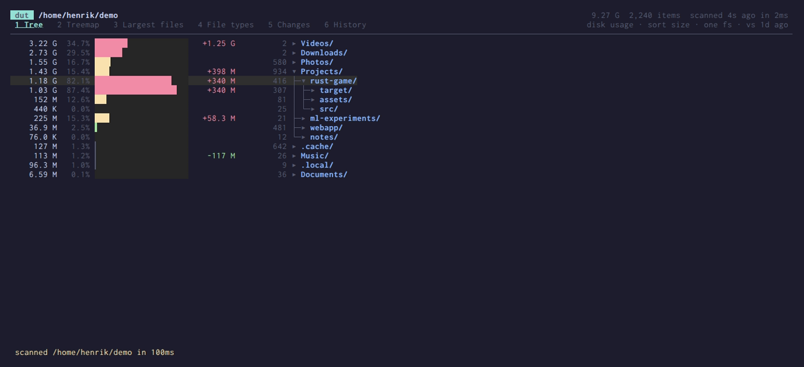
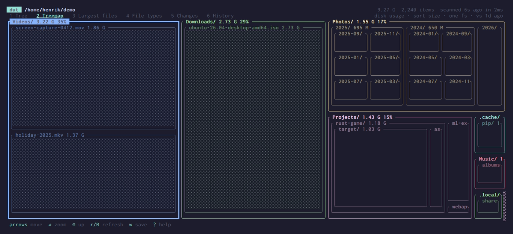
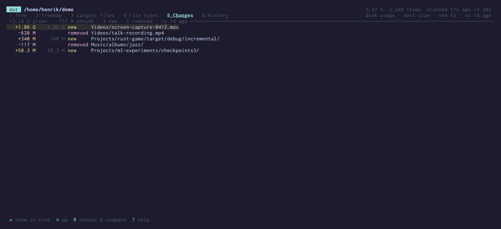
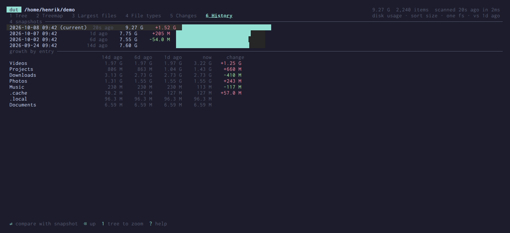

# dut

[](https://github.com/henrikolsson/dut/actions/workflows/ci.yml)

**A fast disk usage analyzer for the terminal that remembers.** It scans in
parallel, opens instantly from the last scan while it refreshes, and shows
what grew since last time.


## Why

`du`, `ncdu` and friends answer *"what is big?"*. dut also answers *"what got
big?"*. Every scan is kept as a compact snapshot. Next time you open the same
directory you see the old result immediately, the rescan runs in the
background, and changes show up as `+1.2 G` / `-300 M` next to each entry.

## Views

| | |
|---|---|
| **Tree**: expandable, with size bars and changes since the last scan<br> | **Treemap**: squarified, nested, navigable with arrow keys<br> |
| **Changes**: biggest growth, new and removed entries<br> | **History**: size over time and growth per entry<br> |

Plus **Largest files** (top 1000 under the current directory) and **File
types** (usage by extension; Enter lists the files of that type).

## Features

- **Fast.** A work-stealing parallel scanner (rayon) stats entries relative
  to the open directory fd. Huge directories are split across threads, and
  results go into a compact arena tree. See [Performance](#performance).
- **Instant reopen.** Full scans are cached in `~/.cache/dut`. Opening a
  directory you've scanned before shows the cached result at once, marked
  as cached, and swaps in the fresh scan when it's done. A subdirectory of a
  cached root opens from the parent's snapshot.
- **Progress with an ETA.** The estimate comes from the previous scan, or
  from filesystem usage (of every mount the scan will enter) when you scan
  a mount root.
- **Changes and history.** Compare with the previous scan, with any saved
  snapshot (`--diff old.dut`), or with any point in the cached history.
- **Correct sizes.** Shows allocated disk usage by default, so sparse files
  count what they really use; `a` toggles apparent size. Hard links are
  counted once.
- **Stays where you point it.** Other mounts are scanned too, except
  virtual filesystems (`/proc`, `/sys`, `/dev`) and network ones (NFS, SMB,
  sshfs), which are skipped unless you pass `--all-mounts`. `-x` stays on
  one filesystem; `-e` excludes globs (`node_modules`, `*.o`,
  `/home/*/.cache`).
- **Careful deletes.** `d` asks first. It never follows symlinks or crosses
  into another filesystem, and reports anything it couldn't remove.
  `--no-delete` turns deleting off.
- **Snapshots you can keep.** `w` saves the scan; `dut -f file.dut` reopens
  it anywhere. The format is lz4-compressed, about 10 bytes per entry.

## Install

Prebuilt binaries for Linux (static, x86_64 and arm64) and macOS (Apple
silicon and Intel) are on the [releases page](https://github.com/henrikolsson/dut/releases).

```sh
# Nix (binaries come from dut.cachix.org; `cachix use dut` to trust it)
nix run github:henrikolsson/dut
nix run .            # or: nix profile install .

# Cargo (Linux, macOS)
cargo install --path .
```

## Usage

```sh
dut                         # current directory
dut /                       # everything, minus virtual and network mounts
dut -x /                    # whole root filesystem, don't cross mounts
dut -e node_modules ~/src   # skip entries by glob (repeatable)
dut -c ~                    # open the cached snapshot without rescanning

dut ~ --no-ui               # refresh the cache without a UI (cron-friendly)
dut ~ -o home.dut --no-ui   # ...and also save to a file
dut -f home.dut             # browse a saved snapshot
dut -f home.dut --refresh   # rescan it and show what changed
dut ~ --diff home.dut       # scan and compare with a snapshot

dut --cache-list            # what's cached, and how much space it takes
dut --clear-cache [PATH]    # forget everything, or one root
```

### Keys

| Key | |
|---|---|
| `1`–`6`, `v` | tree · treemap · largest files · file types · changes · history |
| `j` `k` `↑` `↓`, `PgUp` `PgDn`, `g` `G` | move |
| `l` `→` / `h` `←`, `space` | expand / collapse |
| `*` / `-` | expand subtree / collapse all |
| `enter` / `backspace` | zoom into directory / back out |
| `a` | disk usage ↔ apparent size |
| `s` | sort by size · items · name |
| `r` / `R` | rescan selected directory / everything |
| `d` | delete (asks first) |
| `w` | save snapshot |
| `?` | help |

## Performance

On one laptop (12 cores, NVMe, ext4), with the filesystem cache warm:

| Tree | Entries | dut | GNU `du -sx` |
|---|---|---|---|
| `/nix/store` | 6.2 M | ~4 s | ~2.5 min |
| `~/dev` | 369 k | 181 ms ± 8 ms | |

With a cold cache it's I/O bound: the first `/nix/store` scan took 13.6 s.
Loading a cached snapshot of 6.2M entries takes about a second and peaks
around 680 MB of memory. The `du` figure is a single run. Your numbers will
vary; to benchmark, run `hyperfine` with `dut --no-cache --no-ui -o out.dut DIR`.

## Snapshots and the cache

Snapshots live in `$XDG_CACHE_HOME/dut` (default `~/.cache/dut`, or
`~/Library/Caches/dut` on macOS; `DUT_CACHE_DIR` overrides both), one per root
and option set (`-x`, excludes), readable only by you (`0600`). History is
pruned automatically:

- the 3 newest, then one per day for a week, then one per week for 8 weeks
- roots not scanned for 90 days are dropped
- total size is capped at 2 GiB, removing the oldest history first

`--no-cache` disables reading and writing it.

## macOS

dut runs on Linux and macOS. On a Mac:

- **Scanning `/` counts everything once.** `/Users`, `/Applications` and
  friends are firmlinks into the data volume at `/System/Volumes/Data`, so
  the same files are reachable twice. dut reads `/usr/share/firmlinks` and
  skips the duplicate side, which shows as *(firmlink, counted elsewhere)*.
  `-x /` covers the system and data volumes together. Mounted snapshots
  (Time Machine's local ones) are skipped like network mounts.
- **Scanning is batched.** Sizes come from `getattrlistbulk`, a whole
  directory per call, instead of one `lstat` per file.
- **Totals can differ from Finder.** APFS clones (Finder duplicates,
  `cp -c`) share blocks but each reports its full size, so they're counted
  in full, as `du` does. Local Time Machine snapshots and purgeable space
  aren't visible to a directory scan at all.
- **Some folders need Full Disk Access.** Without it, `~/Library/Mail`,
  `~/Library/Messages`, Safari data and similar show up as unreadable (`!`).
  Grant your terminal access in System Settings → Privacy & Security.

## Development

```sh
nix develop          # rust toolchain
cargo test
cargo build --release
```

CI runs fmt, clippy and the tests on Linux and macOS, plus the Nix build.
Pushing a `v*` tag builds release binaries and publishes a GitHub release.

The demo is reproducible: `demo/make-demo.sh` builds a fake home directory
with backdated snapshots, and `demo/record.sh` records the GIF and
screenshots with [VHS](https://github.com/charmbracelet/vhs):

```sh
nix shell nixpkgs#vhs nixpkgs#libfaketime -c nix develop -c demo/record.sh
```
